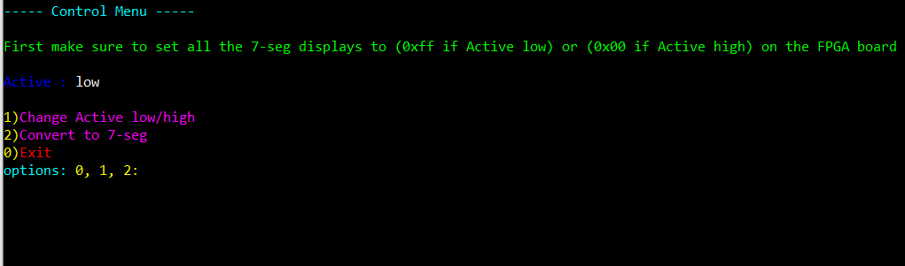
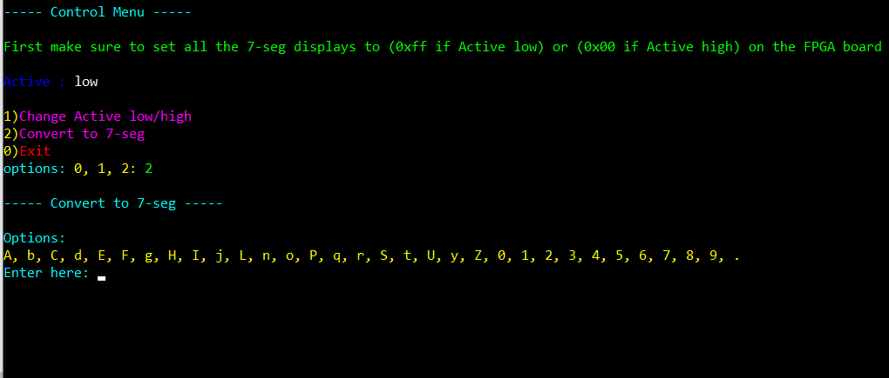
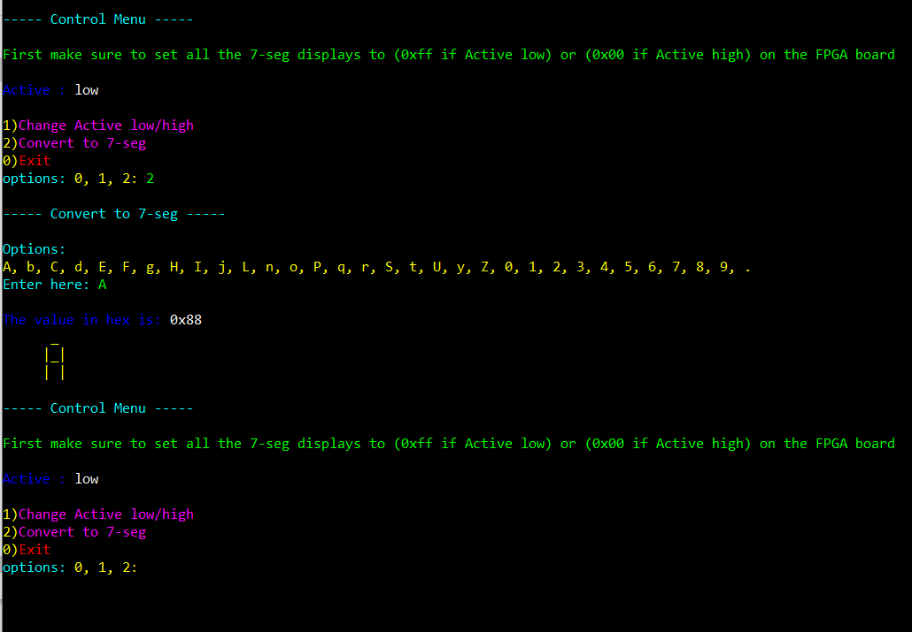

# **A-Zto7seg**

**A tool to convert characters to 7-segment display**

To download the tool [A-Zto7seg.exe](A-Zto7seg.exe) 

To see the code [A-Zto7seg.py](A-Zto7seg.py)

---

- To use these tools
  - First download the A-Zto7seg.exe if on Windows.
  - OR run the source code A-Zto7seg.py (need the following Libraries to run the code if the source code A-Zto7seg.py file. check the libraries section).
 
---
**How to use this tool**

First make sure to set all the 7-seg displays to (0xff if Active low) or (0x00 if Active high) on the FPGA board if such board is being used.
- Active : will show the type of the 7-seg display if it is active low or active high. In other words, if 0 means LED on or if 1 means LED on. 
- choose an option and then click ENTER.
- option 2 will display all the available characters that can be converted to 7-seg format.

---

**To add more characters to the toll**

Step 1) Add the characters to dictionary_AZt07seg 

- This is how the (key : value) is formated.

'character'    :   'binary representation in active low format'    
    'X'        :                 'hgfedcba'
               |
    _          |         a
|       |      |     f       b
    _          |         g
|       |      |     e       c
    _       .  |         d       h
               |
______________ | __________________
    'A'        :     '10001000'           <-- example 
    'X'        :     'hgfedcba'           <-- format 
               |
    _          |         0                <-- 7-seg display 
|       |      |     0       0
    _          |         0
|       |      |     0       0
    _       .  |         1       1    

    
Step 2) Add the new character to the character_list string

---

# Libraries needed for running the source code A-Zto7seg.py

- OS library but this library will be already installed once Python is installed. (To install Python check any tutorial online)
